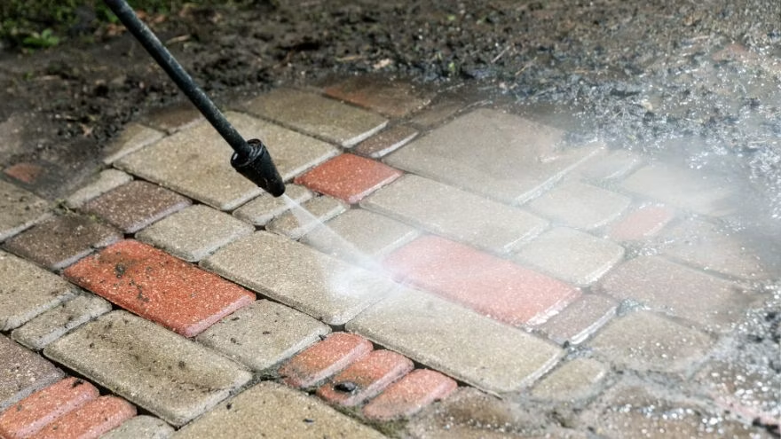

# TURA 4 — HTML (SEO, OBRAZY, STRUKTURA, ACCESSIBILITY)

## Cel
Dodać SEO, lazy loading, poprawić strukturę HTML i accessibility.

---

### 4.1 index.html — HEAD (SEO + OG)

ZASTĄP `<head>` (dodaj wewnątrz, przed `</head>`):

```html
  <!-- Open Graph -->
  <meta property="og:title" content="BartekClean | Profesjonalne Mycie Ciśnieniowe">
  <meta property="og:description" content="Mycie kostki brukowej, elewacji, dachów i podjazdów. Kostrzyn nad Odrą i okolice do 200km.">
  <meta property="og:type" content="website">
  <meta property="og:url" content="https://bartekclean.pl">
  <meta property="og:image" content="https://bartekclean.pl/media/kostka-przed-po.jpg">

  <!-- Twitter Card -->
  <meta name="twitter:card" content="summary_large_image">
  <meta name="twitter:title" content="BartekClean | Profesjonalne Mycie Ciśnieniowe">
  <meta name="twitter:description" content="Mycie kostki brukowej, elewacji, dachów i podjazdów.">
  <meta name="twitter:image" content="https://bartekclean.pl/media/kostka-przed-po.jpg">

  <!-- Canonical -->
  <link rel="canonical" href="https://bartekclean.pl">
```

---

### 4.2 index.html — SCHEMA.ORG

DODAJ przed `</body>`:

```html
  <script type="application/ld+json">
  {
    "@context": "https://schema.org",
    "@type": "LocalBusiness",
    "name": "BartekClean",
    "description": "Profesjonalne mycie ciśnieniowe kostki brukowej, elewacji, dachów i podjazdów.",
    "url": "https://bartekclean.pl",
    "telephone": "+48123456789",
    "email": "kontakt@bartekclean.pl",
    "address": {
      "@type": "PostalAddress",
      "streetAddress": "ul. Moniuszki 5/13",
      "addressLocality": "Kostrzyn nad Odrą",
      "postalCode": "66-470",
      "addressCountry": "PL"
    },
    "geo": {
      "@type": "GeoCoordinates",
      "latitude": "52.5871",
      "longitude": "14.6495"
    },
    "areaServed": ["Lubuskie", "Zachodniopomorskie", "Wielkopolskie", "Dolnośląskie"],
    "priceRange": "$$",
    "openingHours": "Mo-Sa 08:00-18:00"
  }
  </script>
```

---

### 4.3 index.html — CANVAS ARIA

ZASTĄP:
```html
<canvas id="hero-canvas">Twoja przeglądarka nie obsługuje Canvas</canvas>
```
NA:
```html
<canvas id="hero-canvas" role="img" aria-label="Galeria realizacji BartekClean — mycie ciśnieniowe">Twoja przeglądarka nie obsługuje Canvas</canvas>
```

---

### 4.4 index.html — LAZY LOADING OBRAZÓW

DODAJ `loading="lazy"` do WSZYSTKICH obrazów poza hero:

- `media/podjazd-mycie.jpg` (sekcja O nas)
- `media/kostka-czyszczenie.jpg` (Oferta)
- `media/elewacja-mycie.jpg` (Oferta)
- `media/dach-mycie.jpg` (Oferta)
- `media/elewacja-mycie2.jpg` (Oferta)
- `media/kostka-przed-po.jpg` (Oferta)
- `media/kostka-mycie.jpg` (Oferta)
- `media/kostka-przed-po.jpg` (Realizacje)
- `media/elewacja-mycie.jpg` (Realizacje)
- `media/dach-mycie.jpg` (Realizacje)
- `media/podjazd-mycie.jpg` (Realizacje)

Przykład:
```html

```

---

### 4.5 index.html — FORMULARZ ACTION

ZASTĄP:
```html
<form>
```
NA:
```html
<form action="https://formspree.io/f/YOUR_FORM_ID" method="POST">
```

DODAJ ukryte pole:
```html
<input type="text" name="_gotcha" style="display:none">
```

---

### 4.6 index.html — NAWIGACJA ARIA

ZASTĄP `<nav>`:
```html
<nav class="nav" id="nav" aria-label="Główna nawigacja">
```

ZASTĄP `<header>`:
```html
<header class="header" id="header" role="banner">
```

---

## Weryfikacja po TURZE 4
- [ ] Facebook/Twitter podgląd działa (OG tags)
- [ ] Google widzi structured data
- [ ] Obrazy poniżej folda mają lazy loading
- [ ] Formularz ma action i honeypot
- [ ] Canvas ma aria-label
- [ ] Nawigacja ma role i aria-label
